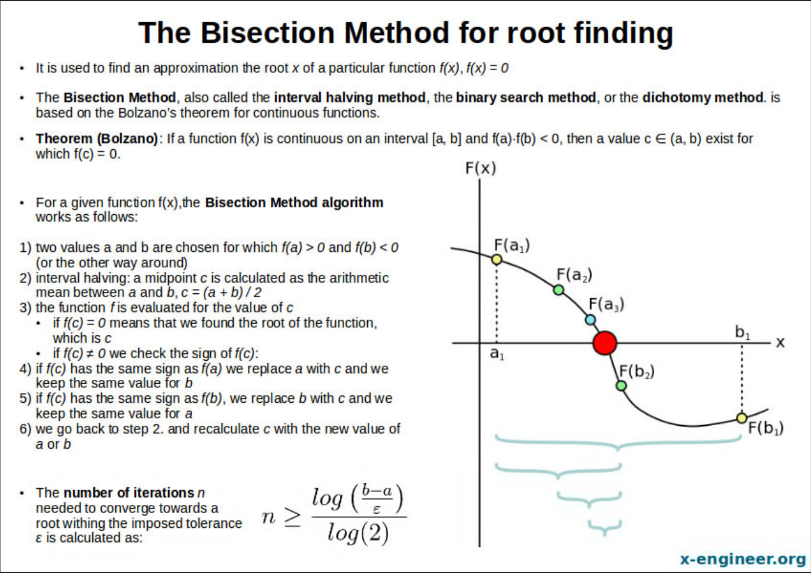

# Numerical Methods - Bisection Analysis

Numerical methods are mathematical techniques used to find approximate solutions to complex problems that prove difficul to solve analytically (get an exact solution). 

They involve algorithms that turn advanced calculus, differential equations, and linear algebra into simple arithmetic operations, such as addition, subtraction, multiplication, and division.

This is a C script to perform the bisection analysis numerical method to arrive at an approximate root of a continuous polynomial function. 

The user inputs two initial guesses of x, with y values which should ideally be on opposite sides of the x-axis (so the intermediate value theorem holds) and the script performs the desired number of iterations and arrives at an approximate root.

[image credit](https://x-engineer.org/bisection-method/)
