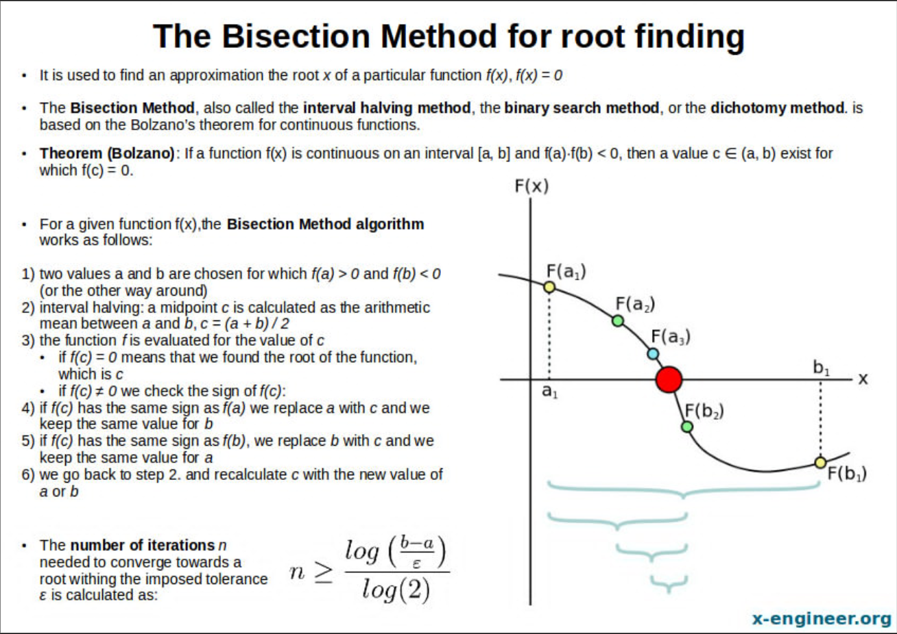

# Numerical Methods - Bisection Analysis

Numerical methods are mathematical techniques used to find approximate solutions to complex problems that prove difficul to solve analytically (get an exact solution). 

The user inputs two initial guesses of x, with y values which should ideally be on opposite sides of the x-axis (so the intermediate value theorem holds) and the script performs the desired number of iterations and arrives at an approximate root.

[image credit](https://x-engineer.org/bisection-method/)
